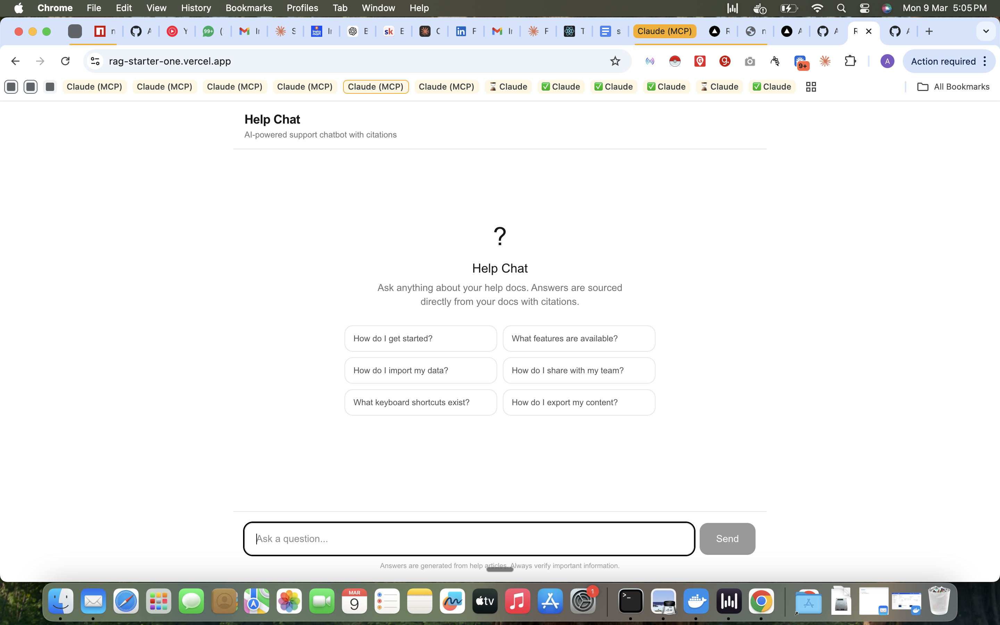
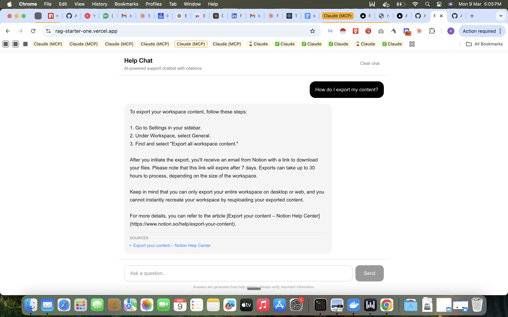

# RAG Starter

Open-source RAG chatbot starter kit. Fork it, point it at your docs, deploy to Vercel.

**Stack:** Next.js + Supabase pgvector + OpenAI (or OpenRouter)

[](https://vercel.com/new/clone?repository-url=https%3A%2F%2Fgithub.com%2Fabhipaddy8%2Frag-starter&env=NEXT_PUBLIC_SUPABASE_URL,SUPABASE_SERVICE_ROLE_KEY,OPENROUTER_API_KEY&envDescription=Set%20your%20Supabase%20and%20LLM%20provider%20keys.%20Use%20OPENROUTER_API_KEY%20or%20replace%20with%20OPENAI_API_KEY.&project-name=rag-starter)

## Live Demo

Try it now: **[rag-starter-one.vercel.app](https://rag-starter-one.vercel.app)**

This demo is powered by Notion help articles — ask it anything about Notion and get cited answers instantly.

| Empty State | Chat with Citations |
|:-----------:|:-------------------:|
|  |  |

## How it works

```
Your Docs → Chunking (800 chars) → Embeddings (text-embedding-3-small)
→ Supabase pgvector → Cosine Similarity Search (top 5)
→ LLM Answer + Citations (GPT-4o-mini) → Scope Guardrail
```

**Features:**
- Vector similarity search with citations
- Scope enforcement — refuses questions outside your docs
- One config file (`rag.config.ts`) to customize everything
- Works with OpenAI direct or OpenRouter
- Ingest via CLI (pass URLs) or REST API
- Dark mode, mobile-friendly chat UI

## Quick Start

### 1. Clone & install

```bash
git clone https://github.com/abhipaddy8/rag-starter.git
cd rag-starter
npm install
```

### 2. Set up Supabase

1. Create a free project at [supabase.com](https://supabase.com)
2. Go to **SQL Editor** in the Supabase dashboard
3. Paste the contents of `scripts/setup-supabase.sql` and click **Run**

This creates:
- `documents` table with pgvector embeddings
- HNSW index for fast similarity search
- `match_documents` RPC function

### 3. Configure environment

```bash
cp .env.local.example .env.local
```

Fill in your keys:

```env
NEXT_PUBLIC_SUPABASE_URL=https://your-project.supabase.co
SUPABASE_SERVICE_ROLE_KEY=your-service-role-key

# Pick ONE:
OPENROUTER_API_KEY=your-openrouter-key
# OPENAI_API_KEY=your-openai-key
```

> **Note:** Never commit `.env.local` — it contains your secret keys. The `.gitignore` already excludes it.

### 4. Ingest your docs

**Option A — CLI script (recommended):**

Pass URLs directly:

```bash
npx tsx scripts/ingest-docs.ts https://docs.example.com/getting-started https://docs.example.com/api
```

Or use a file with one URL per line:

```bash
npx tsx scripts/ingest-docs.ts --file urls.txt
```

You can also use the npm script shorthand:

```bash
npm run ingest -- https://docs.example.com/getting-started
```

**Option B — REST API:**

```bash
curl -X POST http://localhost:3000/api/ingest \
  -H "Content-Type: application/json" \
  -d '{
    "documents": [{
      "content": "Your document text here...",
      "source_url": "https://example.com/doc",
      "article_title": "Getting Started"
    }]
  }'
```

### 5. Customize & run

Edit `rag.config.ts` to set your chatbot's name, system prompt, and suggested questions:

```ts
export const RAG_CONFIG = {
  name: "Acme Support",
  domain: "Acme products",
  systemPrompt: "You are Acme's support bot...",
  suggestedQuestions: ["How do I reset my password?", ...],
};
```

```bash
npm run dev
```

Open [http://localhost:3000](http://localhost:3000).

## Project Structure

```
rag.config.ts              ← Customize everything here
scripts/
  setup-supabase.sql       ← Database schema (run once in Supabase SQL Editor)
  ingest-docs.ts           ← CLI ingestion script (pass URLs as args)
src/
  app/
    api/
      chat/route.ts        ← Chat endpoint (retrieval + LLM)
      ingest/route.ts      ← Document ingestion REST API
      stats/route.ts       ← Health check / stats
    page.tsx               ← Chat UI
  components/
    ChatWindow.tsx         ← Chat interface component
  lib/
    chunker.ts             ← Document chunking
    embeddings.ts          ← OpenAI embedding generation
    retriever.ts           ← Vector similarity search
    llm.ts                 ← LLM answer generation + scope guard
    supabase.ts            ← Supabase client
  types/
    index.ts               ← TypeScript types
```

## Configuration Reference

All settings live in `rag.config.ts`:

| Setting | Default | Description |
|---------|---------|-------------|
| `name` | "Help Chat" | Chatbot name shown in header |
| `domain` | "your help docs" | What your chatbot knows about |
| `systemPrompt` | Generic support bot | Controls LLM behavior |
| `suggestedQuestions` | 6 generic questions | Empty state quick actions |
| `llm.model` | "openai/gpt-4o-mini" | LLM model ID |
| `llm.temperature` | 0.2 | Response creativity (0-1) |
| `retrieval.topK` | 5 | Number of chunks to retrieve |
| `retrieval.similarityThreshold` | 0.2 | Minimum cosine similarity |
| `chunking.chunkSize` | 800 | Characters per chunk |
| `chunking.chunkOverlap` | 200 | Overlap between chunks |

## Deploy to Vercel

1. Push to GitHub
2. Import in [Vercel](https://vercel.com/new)
3. Add environment variables:
   - `NEXT_PUBLIC_SUPABASE_URL`
   - `SUPABASE_SERVICE_ROLE_KEY`
   - `OPENROUTER_API_KEY` **or** `OPENAI_API_KEY`
4. Deploy

Your secret keys are server-side only — they are never exposed to the browser.

## Tech Stack

- **Framework:** Next.js 16 (App Router)
- **Database:** Supabase (Postgres + pgvector)
- **Embeddings:** text-embedding-3-small (1536 dimensions)
- **LLM:** GPT-4o-mini (via OpenAI or OpenRouter)
- **Styling:** Tailwind CSS
- **Language:** TypeScript

## License

MIT
